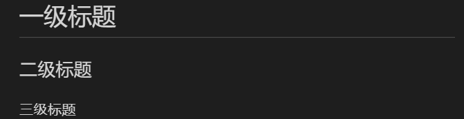

# Markdown 教程练习


## 1. 文本格式化
### 1.1 标题
语法：
~~~
    #   一级标题
    ##  二级标题
    ### 三级标题
    ......
~~~
效果：


### 1.2 斜体、加粗、删除线、引用
~~~
    *斜体*  
    **加粗**  
    ***加粗斜体***  
    ~~删除线~~
    <u>下划线</u>
    ---或者***
    
~~~
效果：


## 2. 段落格式
### 2.1 

`<span>行内代码</span>`

这里是一行<br/>


[^大帅哥]
[^大帅哥]:一个热爱技术的男人


## 列表
无序列表
* 无序列表1
* 无序列表2
* 无序列表3

有序列表
1. 有序列表1
2. 有序列表2
3. 有序列表3

列表嵌套
1. 有序列表1
    * 有序列表1
    * 无序列表2
2. 有序列表2
3. 有序列表3

## 区块
>这是1
>>这是2
>>>这是3

## 代码

段落代码片段`print()`函数

    <html>
        <p>这是一个代码段落，使用tab或者4个空格</p>
    </html>

```javascript
$(document).ready(function () {
    alert('RUNOOB');
});
```

```html
 <html>
     <p>这是一个代码段落，使用tab或者4个空格</p>
</html>   
```
## 链接

直接使用链接地址

<https://www.baidu.com>


 [百度](https://www.baidu.com)

高级链接-链接地址先用变量填充
[链接名称](链接地址)--这里的链接地址是变量
[链接地址]:https://www.baidu.com


## 图片


## 表格

| 左对齐 | 右对齐 | 居中对齐 |
| :-----| ----: | :----: |
| 单元格 | 单元格 | 单元格 |
| 单元格 | 单元格 | 单元格 |

## 高级技巧

使用 <kbd>Ctrl</kbd>+<kbd>Alt</kbd>+<kbd>Del</kbd> 重启电脑